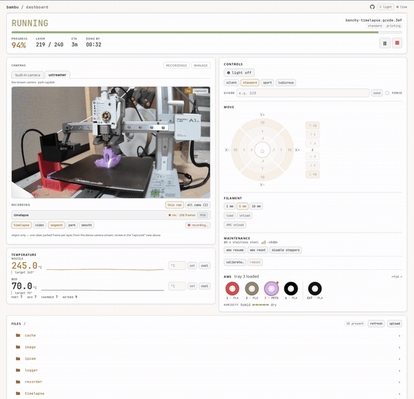
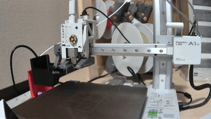

# bambu-rs

[](https://crates.io/crates/bambu-rs)
[](https://docs.rs/bambu-rs)
[](https://github.com/sksat/bambu-rs/actions/workflows/ci.yml)
[](LICENSE)

**English** · [日本語](README.ja.md)

A command-line tool and library for monitoring and driving [Bambu Lab](https://bambulab.com/)
3D printers over the LAN — for a person at the terminal or an AI agent.

It's a **clean-room** implementation: built from the protocol documentation
([OpenBambuAPI](https://github.com/Doridian/OpenBambuAPI)) and direct observation of
real hardware, with no dependency on — or reference to — existing Bambu libraries
(the observed protocol facts are written up in [docs/protocol.md](docs/protocol.md)).
Four mechanisms make it safe to automate: machine-readable JSON (`--json`), a semantic
exit-code scheme, `--confirm`/`--dry-run` gates on every physical action, and
*verify-by-reread* — success is confirmed by re-reading the printer's own report, not by
the command going through.

The `bambu` CLI is designed around an interface that's easy for an AI agent to drive.

> ⚠️ **Only tested on my own A1 mini in LAN mode**. Other
> models / firmware are unverified — treat them as best-effort. It talks to the printer
> directly, with no cloud in the path; controlling a print needs **LAN-only + Developer
> Mode** on the printer, though just reading state doesn't.

## Install

```bash
# prebuilt binary — dashboard included
cargo binstall bambu-rs

# build from crates.io
cargo install bambu-rs

# ...or with the dashboard (needs node + pnpm to build the web UI)
cargo install bambu-rs --features dashboard
```

Prebuilt binaries for Linux, macOS, and Windows are attached to every
[release](https://github.com/sksat/bambu-rs/releases).

## Usage

```bash
# one-time: register a printer (the 8-digit LAN access code is on the printer's screen)
bambu config add --printer a1 --ip 192.0.2.50 --serial <SERIAL> \
  --access-code <CODE> --model a1mini
bambu config list                   # saved profiles
bambu config show                   # the active profile (access code redacted)

# read state — one-shot JSON, or --watch to follow the active print to completion
bambu status --json
bambu status --watch
bambu info                          # firmware + the resolved capabilities for this printer
bambu hms                           # decode any health/maintenance (HMS) alerts

# files on the printer (FTPS): ls / upload / download / rm
bambu file ls
bambu file upload model.gcode.3mf --dest /cache

# start a print: preview the resolved plan, then run it with guards and watch it
bambu job start /cache/model.gcode.3mf --plate 1 --dry-run        # → md5 / plate / AMS map
bambu job start /cache/model.gcode.3mf --plate 1 --ams-map 0 \
  --expect-md5 <md5> --expect-plate 1 --confirm --watch
```

Reading state takes no flags and no checks — just a connect and a snapshot. Physical actions
(`job start/pause/resume/stop`, `temp`, `light`, `gcode`, `ams`, `calibrate`), by contrast,
require `--confirm` and check the printer's own state first (idle, no errors, the expected
file/plate). Under `--json` the output is machine-readable, and the exit code
distinguishes success / unverified / rejected / busy so scripts and agents can branch
on it.

## Slicing

`bambu-rs` doesn't slice — it **delegates to Bambu Studio / OrcaSlicer's CLI** to
produce a sliced `.gcode.3mf`, then uploads and prints it:

```bash
# 1. Slice a model to .gcode.3mf (Bambu Studio / OrcaSlicer CLI)
bambu-studio --slice 1 \
  --load-settings "machine.json;process.json" \
  --load-filaments "filament.json" \
  --allow-newer-file \
  --export-3mf out.gcode.3mf  model.3mf

# 2. Upload, preview the plan, then print it (asserting it's exactly what you inspected)
bambu file upload out.gcode.3mf --dest /cache
bambu job start /cache/out.gcode.3mf --plate 1 --dry-run          # → inspection.gcode_md5
bambu job start /cache/out.gcode.3mf --plate 1 --ams-map 0 \
  --expect-md5 <that-md5> --expect-plate 1 --confirm --watch
```

Full details (flags, AMS mapping, external spool, `--dry-run`) in
[docs/slicing.md](docs/slicing.md).

## Dashboard

`bambu serve` runs a small local server. With the `dashboard` feature enabled, it serves the
web dashboard built into the CLI (without it, you still get the REST API). From a phone or
browser you get live printer status, temperatures, AMS, the live camera, one-click
clean-timelapse capture, and the usual controls — all over the same single LAN connection
(reads are open; control is gated behind an optional password).

<p align="center">
  
</p>

## Timelapse

The printer's own built-in timelapse works as you'd expect: toggle recording with
`bambu timelapse enable/disable`, opt in per print with `job start --timelapse`, and fetch
the finished video with `bambu timelapse get`. Beyond that, `bambu-rs` can record your own
from an **external** camera, driven by the print's own layer events — one frame per layer. It
also covers printers whose built-in camera is missing or broken.

<p align="center">
  
</p>

There are two ways to feed it. Point `bambu timelapse capture` at any tool to grab a frame
each layer (the command after `--` runs as argv, never via a shell, with
`{frame}`/`{layer}`/`{outdir}` substituted in):

```bash
bambu timelapse capture --out-dir ./tl -- fswebcam -r 1280x720 {frame}

# a USB camera served over HTTP by µStreamer (its /snapshot endpoint):
bambu timelapse capture --out-dir ./tl -- \
  curl -s -m 15 -o {frame} "http://$USTREAMER_HOST/snapshot"

# an IP camera (e.g. an ATOM Cam running atomcam_tools) over plain HTTP:
bambu timelapse capture --out-dir ./tl -- \
  curl -s -m 15 -o {frame} "http://$ATOMCAM_HOST/cgi-bin/get_jpeg.cgi"
```

Or, for the smooth result above, `bambu timelapse park` reads a camera's MJPEG stream and
picks the **parked** frame for each layer on-device — the head clear of the object — so you
don't have to time the grab yourself. The `bambu serve` dashboard wraps the same into
one-click capture:

```bash
bambu timelapse park http://<host>/stream --config tuning.json --out ./tl --assemble out.mp4
```

Either way, a failed grab is skipped and a suggested `ffmpeg` line is printed to stitch the
frames.

## More commands

```bash
bambu speed standard                 # silent | standard | sport | ludicrous
bambu light on --node chamber        # on | off  ·  --node chamber | work
bambu gcode "G28"                    # over-limit temps / cold extrusion refused unless --force
bambu ams resume                     # resume | reset | pause | change | set-filament | settings
```

Physical actions take `--confirm`; `ams change`/`set-filament` also support `--dry-run`.
Deeper slicer integration comes later.

## Library

The protocol and safety logic live in a reusable Rust crate — the `bambu` CLI and the
`bambu serve` dashboard are both just consumers of it.

```toml
[dependencies]
bambu-rs = { version = "0.1", default-features = false }   # library only — no CLI/server deps
```

```rust
use bambu_rs::client::LanMqttClient;
use bambu_rs::config::ResolvedTarget;
use bambu_rs::core::command::{Command, ProjectFile};
use bambu_rs::core::model::Model;
use bambu_rs::core::session::CommandOutcome;

let client = LanMqttClient::new(ResolvedTarget {
    ip: "192.0.2.50".into(),
    serial: "<SERIAL>".into(),
    access_code: "<CODE>".into(),
    model: Model::A1Mini,
});

// Full calibration. `send_and_verify` confirms the routine actually started by
// re-reading the printer's own report — not just that the publish succeeded.
let outcome = client.send_and_verify(&Command::Calibration {
    bed_level: true,
    vibration: true,
    motor_noise: true,
})?;
assert_eq!(outcome, CommandOutcome::Verified);

// Print a sliced 3MF already uploaded to the printer (plate 1).
let job = ProjectFile::new("ftp:///cache/model.gcode.3mf", 1, "my-print");
client.send_and_verify(&Command::ProjectFile(job))?;
```

Per-firmware differences are captured as *capabilities* of a given `(model, firmware)`: how
the camera streams (the A1 sends JPEG over a raw TCP socket; X-series printers use RTSP),
whether a temperature command is still honoured once a print is running (newer firmware
silently ignores it), whether state arrives as one full snapshot or as deltas, even a field
name whose spelling changed between releases. The set is resolved once on connect, and
command-building, report parsing, and the safety checks all read from it instead of
scattering `if firmware >= …` branches through the code. `bambu info` prints it for the
connected printer:

```
$ bambu info
printer: a1 (a1mini)
firmware: 01.07.02.00
registry: supported
push:     delta_only
camera:   jpeg_tcp_6000
control:  requires_developer_mode — control needs LAN-only + Developer Mode enabled
modules:
  ota        hw OTA       sw 01.07.02.00  Bambu Lab A1 mini
  esp32      hw AP05      sw 01.16.39.58
  mc         hw MC02      sw 00.01.30.10
  th         hw TH03      sw 00.00.07.72
  ams_f1/0   hw AMS_F102  sw 00.00.08.15  AMS Lite
```
